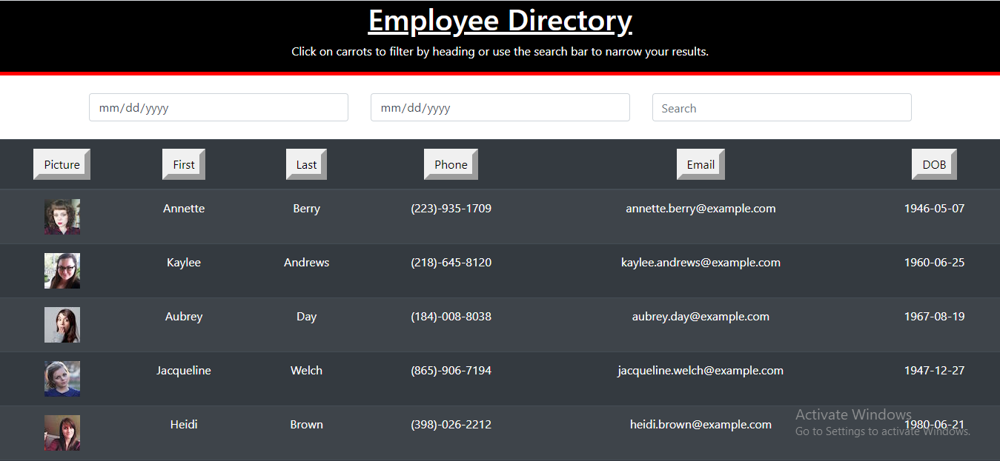
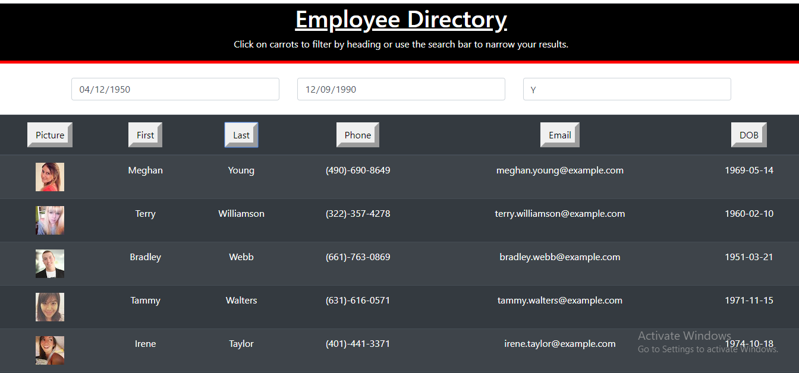

# HW---19---React-Employee-Directory

- [User Story](#User-Story)
- [General Info](#General-Info)
- [Instructions](#Instructions)
- [Motivation](#Motivation)
- [Future Functionality](#Future-Functionality)
- [References](#References)

## User Story

As a user,
I want to be able to view my entire employee directory at once
so that I have quick access to their information

## General-Info

This Employee Directory was our first project using React.js. It features a React based file layout, several React hooks, and a responsive UI specific to user input needs. All usable components are coded separately and imported into the App.js file where structure and backend knowledge is handled. Implementing React algorithims was a daunting task but it gave me exposure to new features and a more organized workspace.

## Instructions

To successfully run this application, the user should first clone the repository into a local file and run npm install. Using the local console, user will run "npm i" on the included dependencies. After, run "npm run start" and on your local browser, type in "localhost:3000." Alternatively, the deployed application can be visited on "GitHub pages." This will bring up the UI where the user can filter a set of "Random API" called persons by name or date of birth range.

Alternatively, there is an additional option to sort each person by the buttons on table heading such as "Phone Number" or "Last Name." These can be interwoven with the search parameters giving the user multiple levels of filtered content.

## Motivation

ALthough our introduction to React at times was overwhelming, the organized aspects and functional capabilities of this library made it a worthwhile task. I was motivated to learn React's features, gearing up towards becoming proficient at MERN Full-Stack. Implementing React is a pivotal step in this bootcamp and is one I am motivated to excel at.

## Future Functionality

Future functionality for this app will most definitely include incorporating more React components as we progress through the bootcamp. Additional search parameters and local caching are some aspects that would add more to this application.

## References

https://developer.mozilla.org/en-US/docs/Web/HTML/Element/input/date
https://www.youtube.com/watch?v=Law7wfdg_ls
https://randomuser.me/
